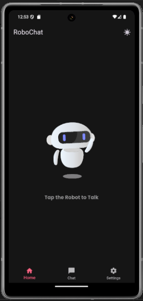

# RoboChat
A Friendly AI-personal ChatBot and voice assistant

# Tech Stack
1. Flutter, Dart
2. BloC State Managment
3. OpenRouter API Key

# Flutter Packages Used
  flutter_bloc: ^9.1.1
  equatable: ^2.0.7
  google_fonts: ^6.2.0
  animated_text_kit: ^4.2.3
  speech_to_text: ^7.1.0
  http: ^1.4.1
  shared_preferences: ^2.5.3
  lottie: ^3.1.0
  flutter_svg: ^2.2.0
  bloc: ^9.0.0
  permission_handler: ^12.0.1

# Light Thmee

# Dark Theme 

# Setting
